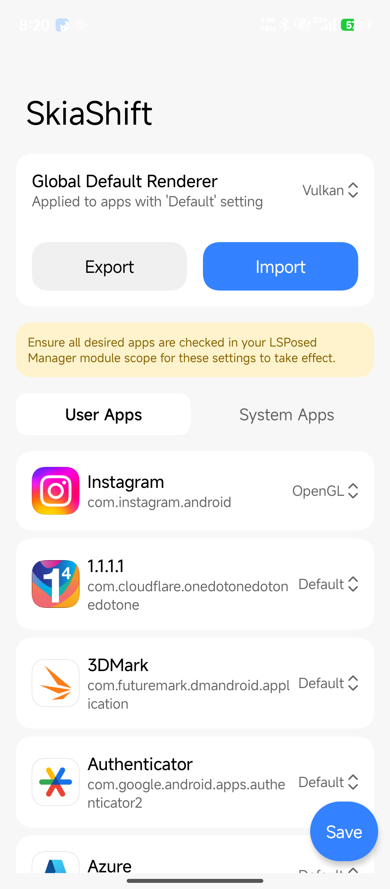
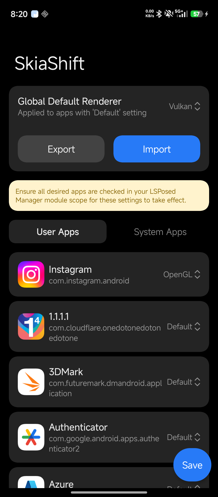

# SkiaShift

SkiaShift is an advanced, root-level Android rendering engine manager built as an LSPosed module. It allows granular control over the hardware-accelerated 2D rendering engine (HWUI), giving users the ability to force Vulkan (`skiavk`) or OpenGL (`skiagl`) on a per-app basis.

SkiaShift directly addresses issues where certain apps crash or suffer severe performance degradation (SIGSEGV) under specific rendering backends, allowing you to maximize battery efficiency and performance dynamically.

## Features

- **Per-App Rendering Override:** Force OpenGL or Vulkan explicitly on any installed application.
- **Native Memory Hooking:** Utilizes ByteHook and ShadowHook to intercept and override system properties natively in memory. Bypasses Android's read-only (`ro.*`) restrictions dynamically without modifying the system partition.
- **Miuix Design System:** A clean, modern, and fluid user interface powered by `top.yukonga.miuix.kmp` featuring dynamic day/night theming.
- **Storage Access Framework (SAF):** Easily backup and restore your configuration to JSON files directly onto your device's storage.
- **Global Fallback Control:** Set a system-wide default rendering engine, with granular overrides for problematic applications.

## Screenshots

  
  

## Prerequisites

- **Android Version:** Android 12 to 16.
- **Root Access:** Magisk or KernelSU.
- **LSPosed Framework:** Required to inject the native hooks into target applications.

## Installation

1. Download the latest `app-debug.apk` release or compile the project from source.
2. Install the APK on your device.
3. Open **LSPosed Manager**.
4. Enable the **SkiaShift** module.
5. In the module scope, select all applications you wish to apply custom rendering rules to.
6. Reboot your device (or perform a soft reboot) to apply the hooks.

## Usage

1. Open the **SkiaShift** app.
2. Under the **Global Default Renderer**, choose your preferred system-wide backend (Vulkan or OpenGL).
3. Scroll through the application list and select specific rendering engines for any app requiring overrides (e.g., forcing OpenGL on a legacy game that crashes under Vulkan).
4. Tap the **Save** floating action button to apply the global properties via Root.
5. (Optional) Use the **Export Configuration** and **Import Configuration** options to backup your settings via the system file picker.

## How It Works

Android 12+ transitioned HWUI to Skia, bringing both Vulkan (`skiavk`) and OpenGL (`skiagl`) pipelines. Some system implementations default to Vulkan for efficiency, which can cause older apps to instantly crash due to Buffer Age or Task Splitting incompatibilities.

Since the `ro.hwui.use_vulkan` property is read-only, SkiaShift leverages **ShadowHook** and **ByteHook** written in native C++ to intercept `__system_property_get`, `property_get`, and `android::base::GetProperty` at runtime. 
When an injected application queries the system rendering backend, SkiaShift seamlessly feeds it the specific `ro.hwui.use_vulkan` and `debug.hwui.renderer` values assigned to it via the configuration file, forcing the GPU to compile the correct HWUI pipeline.
